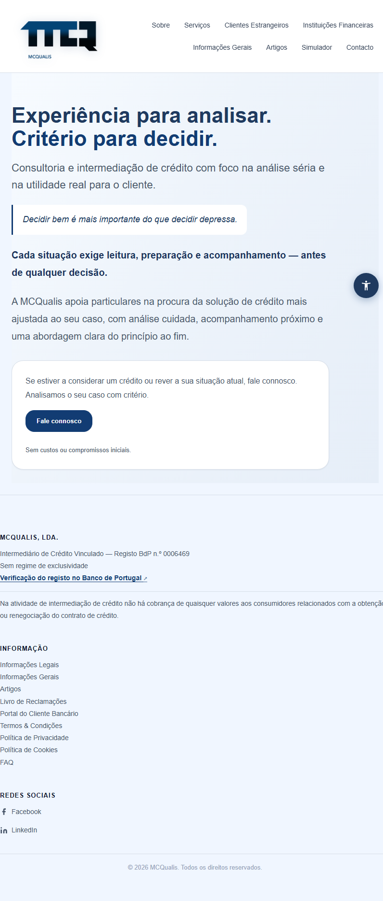
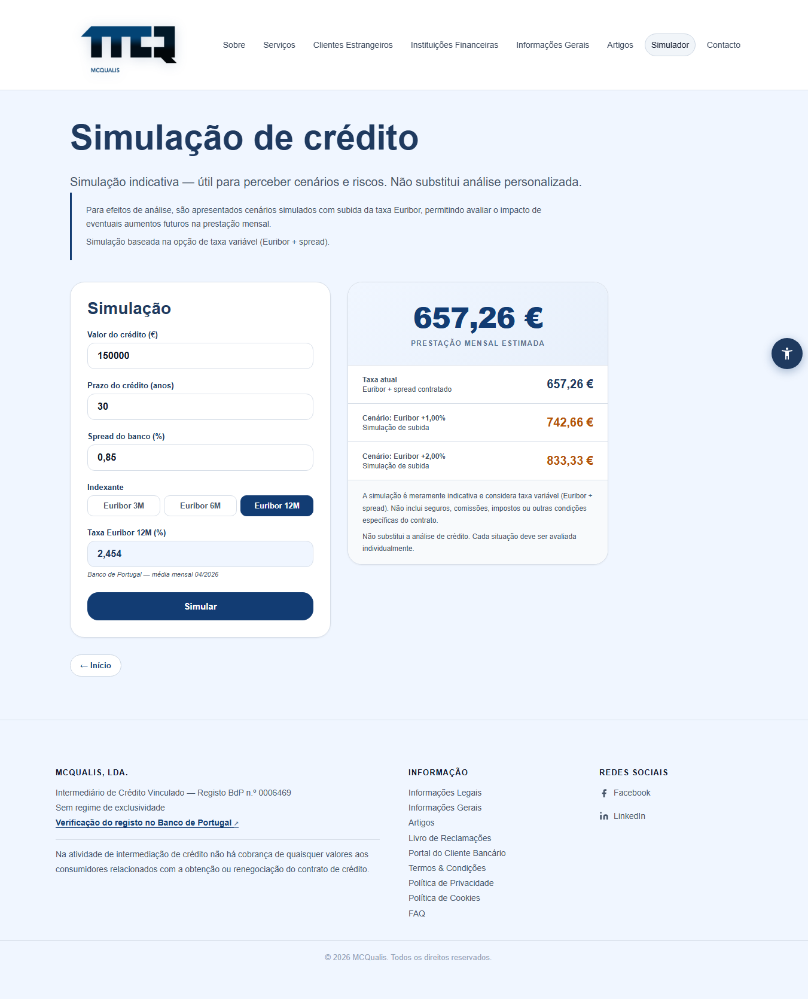
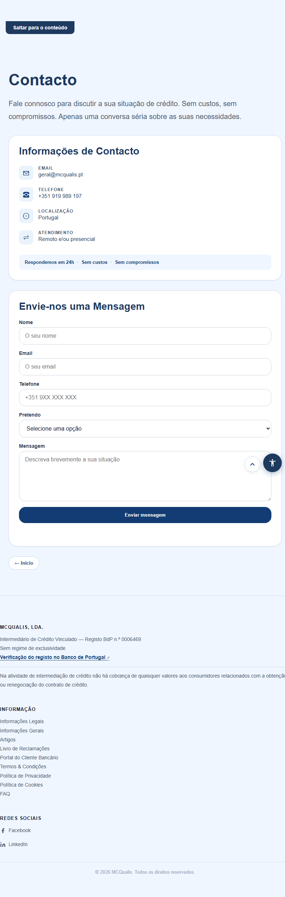
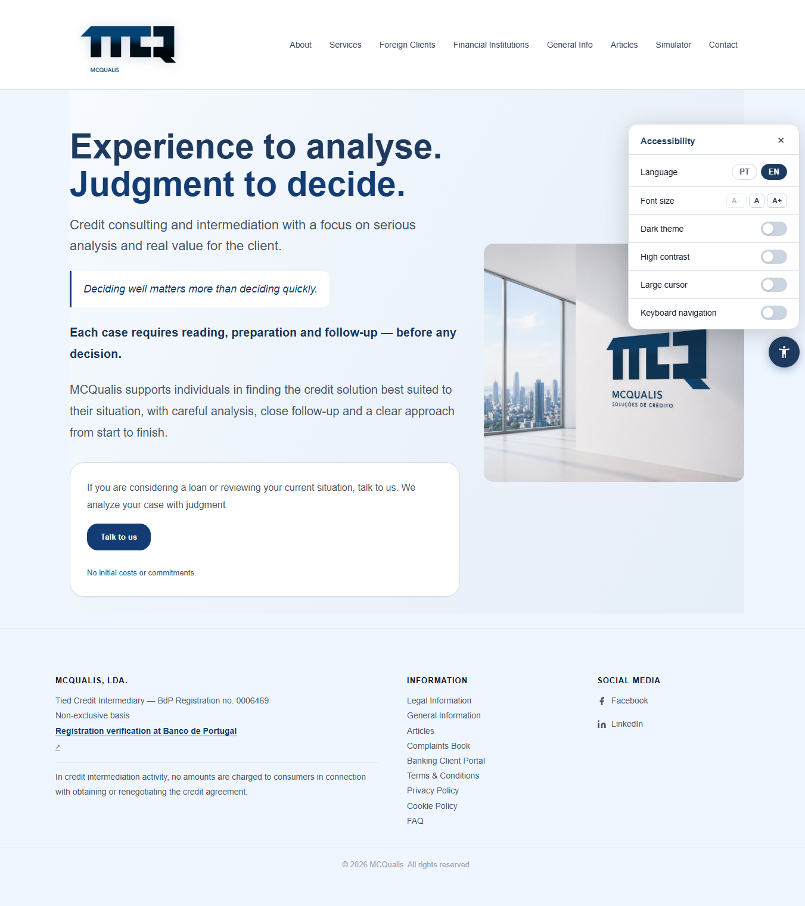
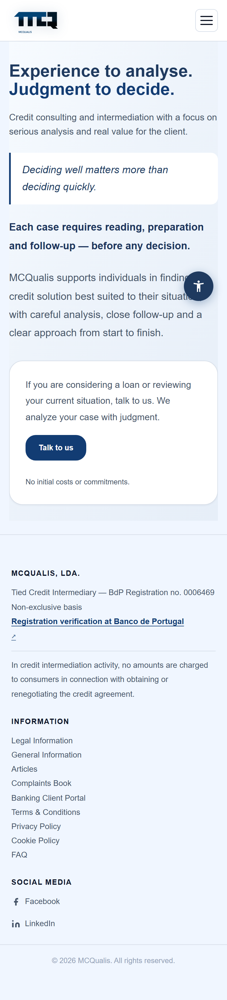

# MCQualis — Institutional Website

> **Live site:** [mcqualis.pt](https://www.mcqualis.pt) &nbsp;·&nbsp; Freelance project for MCQualis, a Banco de Portugal-certified credit intermediary.



---

## About the Project

Took ownership of an unstructured legacy codebase for MCQualis, a regulated credit intermediary licensed by the Banco de Portugal, and brought it to its current state. The site covers mortgage credit, personal credit, and financing for both Portuguese residents and foreign clients.

## My Role

Curricular internship (FCT) — as the sole developer, inherited disorganised legacy code and restructured the entire front-end: established a coherent architecture, introduced the bilingual system, integrated two external APIs, built the credit simulator and accessibility panel, and standardised the responsive layout.

---

## Key Technical Features

### 1. Live Euribor Rates — BPstat API (Banco de Portugal)

The credit simulator fetches real-time Euribor rates (3M, 6M, 12M) from the official Banco de Portugal statistics API. Challenges included undocumented series IDs and an unconventional response structure where values are indexed by series position rather than named keys.

- Session-level caching — one request per page visit regardless of how many times the user switches the term
- Graceful degradation — if the API is unreachable, the field unlocks for manual input instead of breaking the simulator
- Bilingual reference date (`Banco de Portugal — média mensal MM/YYYY` / `monthly average MM/YYYY`)

[See snippet →](snippets/euribor-api.js)

### 2. Async Contact Form — Formspree API

The contact form submits without a page reload using the Fetch API and `FormData`.

- `Accept: application/json` header to receive structured responses
- Bilingual success/error feedback driven by the active language at submit time
- Full form reset on success

[See snippet →](snippets/contact-form.js)

### 3. Bilingual System (PT/EN)

Language switching handled almost entirely in CSS — no per-element JS toggling.

```css
html[data-lang="pt"] .lang-en { display: none; }
html[data-lang="en"] .lang-pt { display: none; }
```

- `setLanguage(lang)` sets a single `data-lang` attribute on `<html>` and the CSS does the rest
- `localStorage` persists the user's choice across sessions
- Dynamic `<select>` options and `placeholder` attributes are rebuilt in JS only where CSS cannot reach

### 4. Vanilla SPA Navigation

Single-page architecture without any framework or router. `showSection(id)` manages:

- `display`/`hidden` toggling for all 11 sections
- Nav active states via `data-section` attributes
- URL hash support (`window.location.hash`)
- Keyboard focus moved to the section heading on navigation (WCAG 2.1)
- Mobile hamburger menu close on section change

### 5. Credit Simulator

PMT formula (French amortization) calculating monthly payments at the current Euribor + spread, plus two stress-test scenarios (+1% and +2%), so clients can visualise their exposure to rate rises.

### 6. Accessibility Panel

Custom panel with persistent preferences (all saved to `localStorage`):

- Font size control (3 levels)
- Dark theme
- High-contrast mode
- Large cursor
- Keyboard navigation mode

---

## Tech Stack

| | |
|---|---|
| **Languages** | HTML5, CSS3, JavaScript ES6+ |
| **External APIs** | BPstat / Banco de Portugal · Formspree |
| **Architecture** | Vanilla SPA — no framework, no build step |
| **Styling** | CSS custom properties (design tokens), mobile-first responsive |
| **Accessibility** | ARIA roles, keyboard navigation, WCAG 2.1 considerations |

---

## Screenshots

| | |
|---|---|
|  |  |
|  |  |

---

## What I Learned

**Working with a government financial API** — BPstat has sparse public documentation. Understanding the response structure (`dimension.reference_date.category.index` as a flat value array indexed by series × observation) required reading the raw JSON and reverse-engineering the mapping. The session cache and graceful fallback came directly from that investigation.

**No-framework SPA** — building routing, focus management, and mobile nav without React or Vue forced me to understand what those abstractions actually solve. The result is a zero-dependency page that loads instantly.

**Bilingual without an i18n library** — the CSS `data-lang` approach keeps language switching fast and the markup readable, at the cost of duplicating content in HTML. For a site this size it was the right trade-off.

**Client constraints in a regulated industry** — brand compliance (specific image formats, legal copy mandated by Banco de Portugal) is non-negotiable. Delivering features within those constraints was part of the job.
